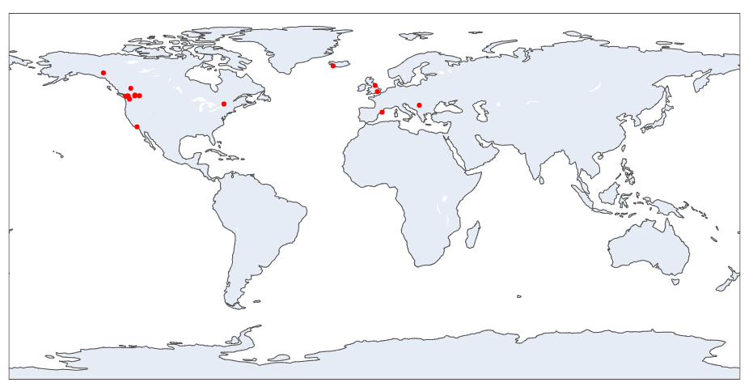

# Audio Descriptors Corpus

Analysis and data manegent for the audio descriptors study.

## Data Files
*descriptors_{date}.csv* is the current edited survey data.
*qualtrics_raw.csv* is the data file directly from qualtrics.
*SoundDescriptorsParsed.xlsx* stores the official tags list for the literature and survey corpora.

## Dependencies

* Requirements listed in requirements.txt file
* Tested on Windows 10 / Linux
```
pip install -r requirements.txt
```

---

## Getting Current Statistics
```
python statistics.py
```
Results will look something like:
```
-------------- SURVEY STATS --------------
STAT                               VALUE   
-----------------------------------------------
total responses                    87.00
completion count                   23.00
abandon count                      64.00
completion rate %                  26.44
average completion time (m)        153.67
min completion time (m)            4.33
max completion time (m)            1324.68
trim mean completion time (m)      30.23

-------------- TAG STATS --------------
STAT                               VALUE   
-----------------------------------------------
total tags                         938.00
total unique tags                  598.00
total unique tag/class pairs       648.00
total descriptor tags              530.00
unique descriptor tags             378.00
total emotion tags                 408.00
unique emotion tags                270.00
tags described as both             50.00
% tags in dictionary               92.81

-------TAGS IN BOTH---------------
{'uplifting', 'blaring', 'noisy', 'natural', 'expectant', 'alarm', 'enticing', 'close', 'powerful', 'dark', 'watery', 'mellow', 'energetic', 'fast', 'alert', 'warning', 'urgency', 'nature', 'on-edge', 'happy', 'smooth', 'chaotic', 'edgy', 'comfortable', 'moist', 'falling', 'alarming', 'busy', 'scary', 'mechanical', 'harmonious', 'calming', 'loud', 'movement', 'futuristic', 'warm', 'abrasive', 'rhythmic', 'light', 'artificial', 'exciting', 'annoying', 'bright', 'playful', 'dangerous', 'angry', 'soft', 'naturalistic', 'urgent', 'strident'}

-------MOST COMMON TAGS------------
[('synthetic', 12), ('sharp', 10), ('bright', 10), ('alarming', 10), ('annoying', 9), ('abrasive', 8), ('scary', 8), ('exciting', 7), ('tense', 7), ('alert', 7)]
```

---



## Getting Word Embeddings as Tensors
```
python write_tensors.py
```

Survey responses only:
* tags_survey.tsv
* tensors_survey.tsv

Survey responses and literature descriptors:
* tags_all.tsv
* tensors_all.tsv

Output files stored in the **outputfiles** directory.

Plot here: https://projector.tensorflow.org/
Select the tensors file for vectors, and the corresponding tags file for metadata.


---

## Extracting Word Definitions
Takes ~3 hours to extract definitions for all words. **Not updated to only extract definitions where we dont already have them yet.**

Will only need to run this each time we collect new descriptor data in the *descriptors_{date}.csv* file. View the definitions in the *SoundDescriptorsParsed.xlsx* file on the *Survey Descriptors* sheet.

```
python definitions.py
```


---

## Author
Joshua Kranabetter